## 📧 IdentityEmail

---
## 📋 Proje Hakkında
IdentityEmail, e-posta yönetimini kolaylaştıran ve yapay zeka ile desteklenen bir web uygulamasıdır. Kullanıcılar tek bir yerden gelen ve gönderilen mesajları yönetebilir, kategorilere göre filtreleyebilir ve dashboard üzerinden istatistiklerini takip edebilir. Uygulama, mesajları otomatik kategorilendirme, önceliklendirme ve kısa cevap önerileri sunma gibi AI özellikleriyle kullanıcı deneyimini iyileştirmeyi hedefler. Kayıt ve her girişte 6 haneli doğrulama kodu ile iki faktörlü doğrulama kullanılır; böylece hesap güvenliği güçlendirilir.

---

## 🛠️ Kullanılan Teknolojiler

### 📌 Backend: ASP.NET Core MVC 9.0
### 📌 ASP.NET Core Identity (iki faktörlü doğrulama ile birlikte)
### 📌 Veritabanı: SQL Server, Entity Framework Core
### 📌 E-posta gönderimi: MailKit / MimeKit, SMTP (Gmail)

### 🤖 Yapay zeka entegrasyonları

### 📌Google Gemini (Generative Language API): 

Gönderilen e-postaların konu ve içeriğine göre otomatik kategori (İş, İşletme, Aile, Arkadaşlar, Okul) ve öncelik (Yüksek, Orta, Düşük) atanması. Bu sayede gelen kutusu kategorilere göre filtrelenebilir ve önemli mesajlar öne çıkarılır.

### 📌OpenAI (Chat Completions API):

Dashboard’da kullanıcının gönderilen/gelen mesaj sayıları ve son mesaj içeriklerine göre kısa aktivite özeti üretilmesi.
Mesaj detay sayfasında, gelen mesajın içeriğine göre cevap önerisi üretilmesi; kullanıcı bu metni doğrudan yanıt olarak kullanabilir veya düzenleyebilir.

---

## 🖼️ Ekran Görüntüleri

### 🏠 Ana Sayfa

  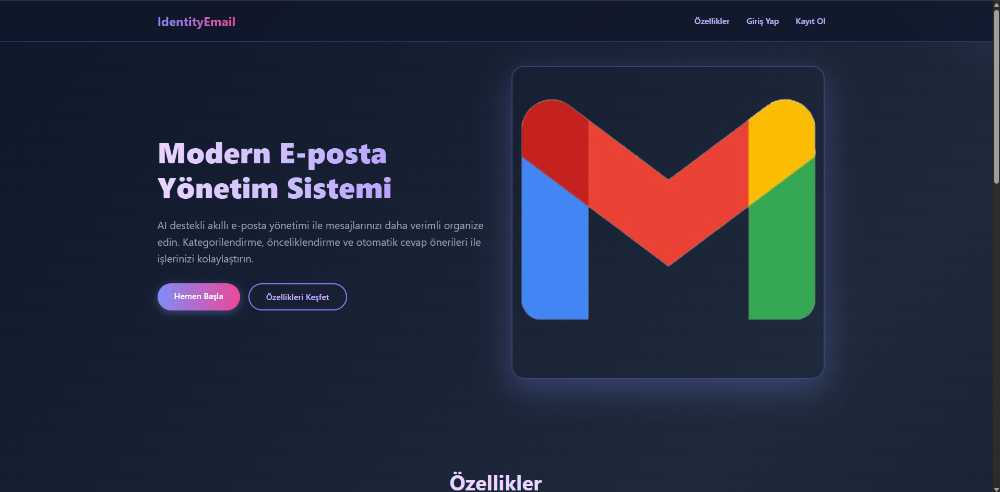
  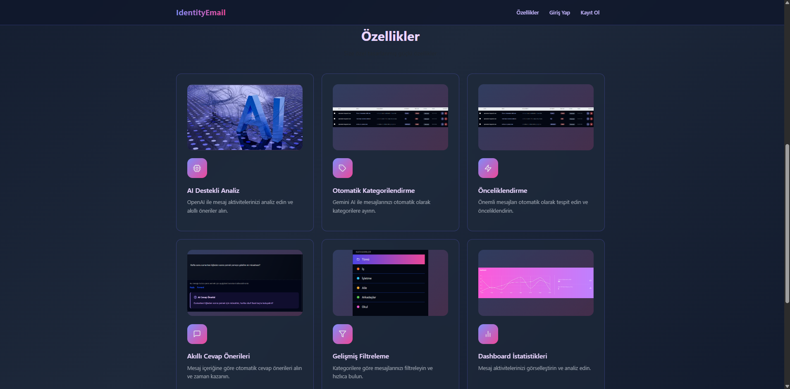
  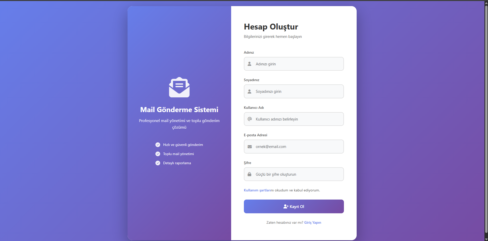
  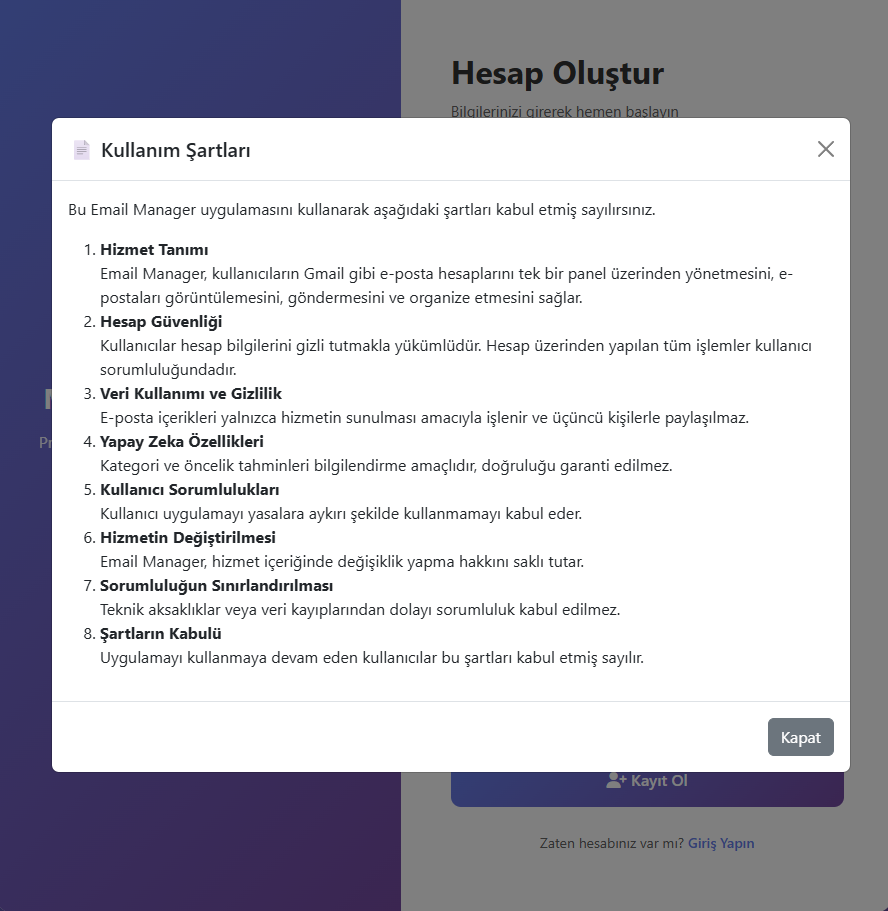
  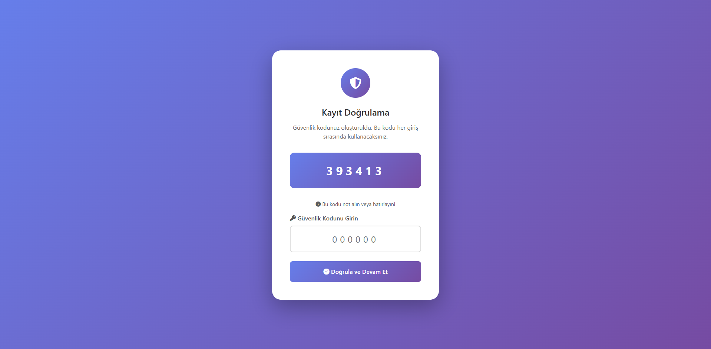
  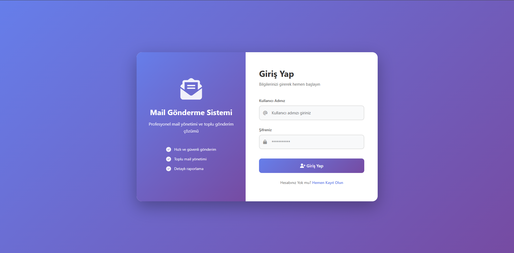
  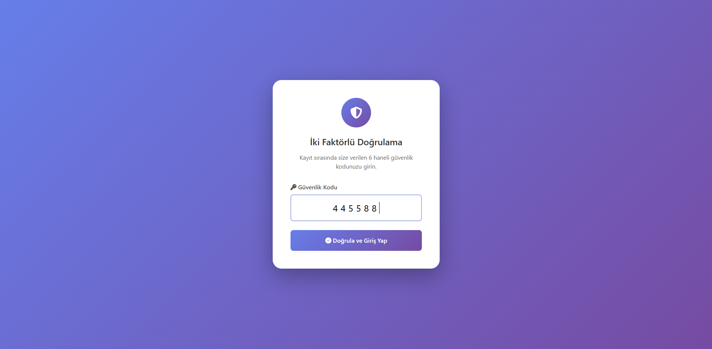

### 🔐 Kullanıcı Paneli

  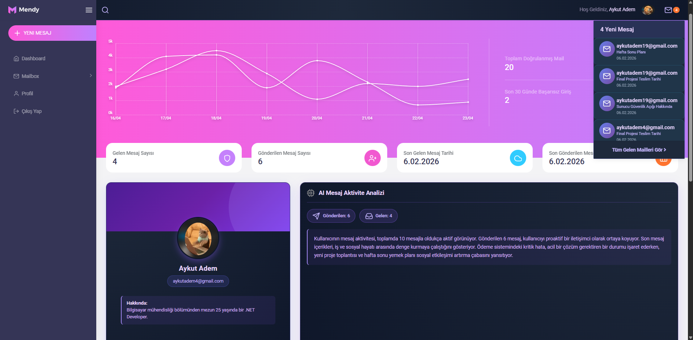
  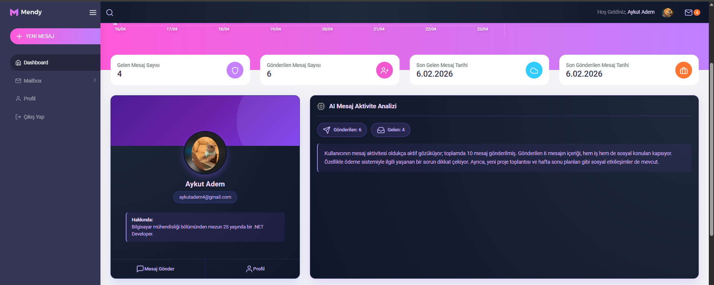
  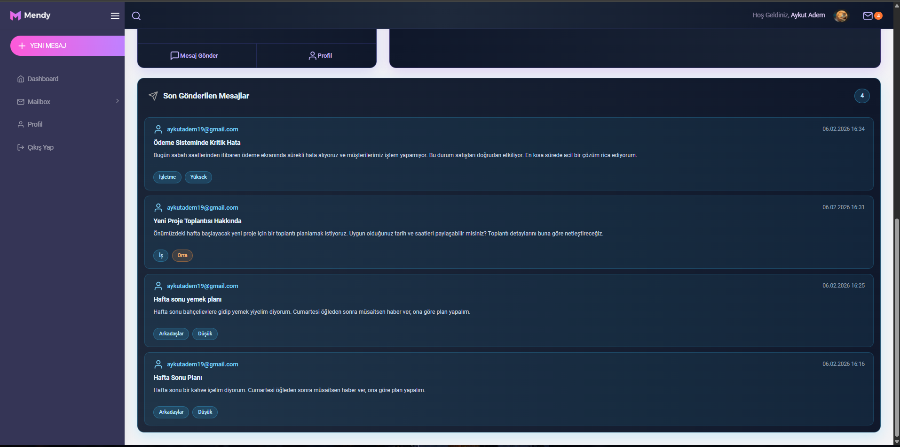
  
  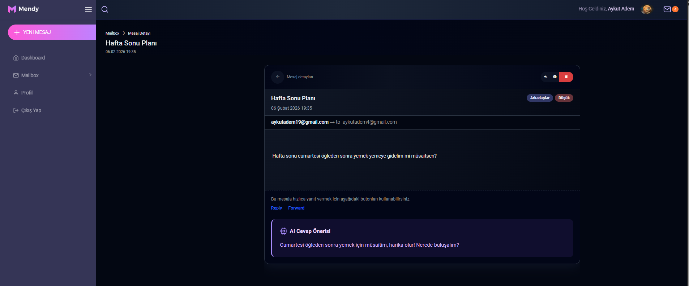
  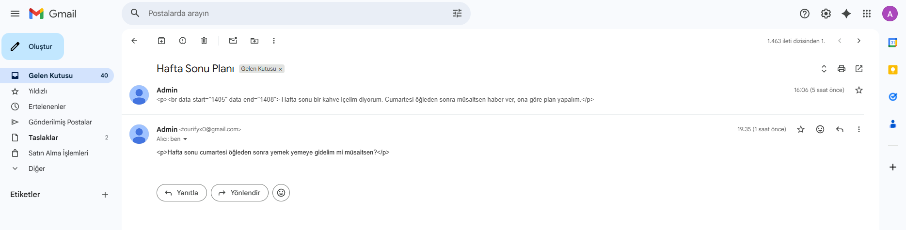
  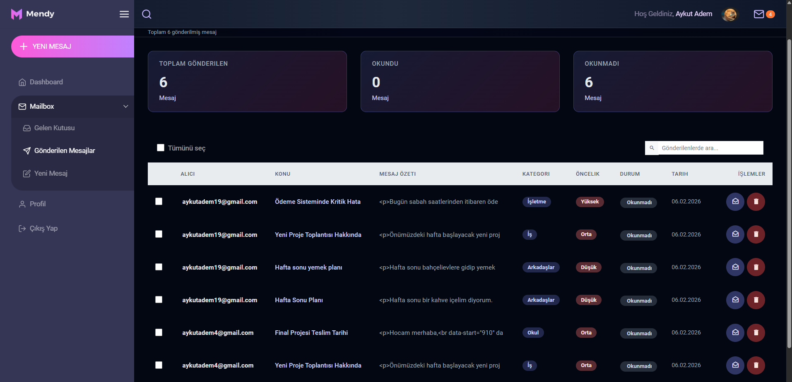
  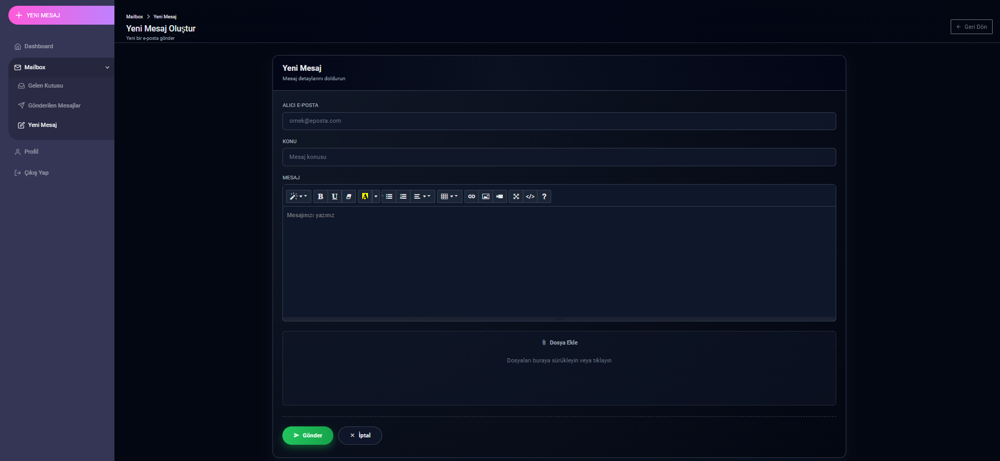
  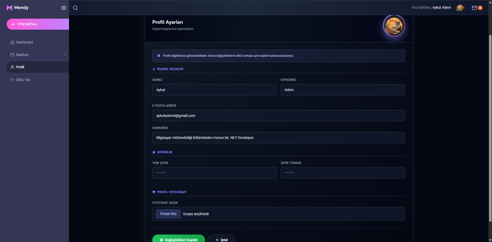

